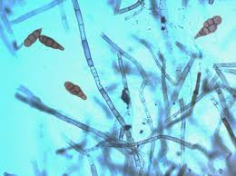

## Evolution to Novel Environments

### Invasion Genomics : Adapting to Novel Locations

*Figure 1: Map of global Trifolium repens collections world wide and their ancestral proportions calculated from NGSadmix best K = 3.*

Worldwide populations of invasive species provide unique opportunities to study how evolution unfolds across both similar and divergent environmental gradients on different continents. In white clover (Trifolium repens), we have identified parallel patterns of cyanogenesis clines in North America and Europe, as well as unique haploblocks linked to key fitness traits. At the same time, invasive populations may also follow distinct evolutionary trajectories that diverge from native phenotypes. For example, our work shows that North American populations of white clover rely more on drought avoidance strategies than on drought tolerance—an important distinction from their European ancestors (Figure 2). 

*Figure 2. Response of European and North American populations of white clover (Trifolium repens) to two drought treatments: (A) wilt VWC, representing drought avoidance, and (B) rehydration, representing drought tolerance. European populations exhibited greater drought tolerance, as evidenced by higher rehydration success. In contrast, North American populations showed reduced rehydration success but demonstrated a stronger drought avoidance strategy.*
We have begun to characterize the molecular networks underlying these differences, but further research is needed to refine these networks and identify critical “triggers”—genes that play outsized roles in directing drought responses and shaping adaptation to hotter, drier environments. Understanding these mechanisms is essential for pinpointing the traits that underlie the global invasion success of T. repens.

The genome of T. repens not only encodes functional traits that drive invasion but also contains molecular markers that allow us to trace its ancestry. A central question in invasion biology is: Where did invasive populations come from? This is relatively straightforward for species with narrow distributions, but for species like T. repens, with widespread introductions across continents, the story is far more complex. In the native range, populations diverge and adapt to local environmental gradients, resulting in unique suites of traits. Depending on historical proximity to human populations, some of these local genotypes were preferentially transported across regions and oceans. Thus, the origins of introduced populations influence not only their adaptive potential but also their genetic diversity and propagule pressure, shaped by patterns of human-mediated dispersal. In the case of white clover, our research shows that U.S. populations initially derived from the U.K. and Belgium but were later replaced in the southern United States by lineages from Spain (Figure 3a). Crucially, these Spanish populations carried higher frequencies of cyanogenesis—a chemical defense against herbivory—which has proliferated in the hot, insect-rich environments of the Gulf Coast, providing a strong ecological advantage (Figure 3b).

*Figure 3. Admixture proportions of native-range white clover (Trifolium repens) populations from seven major European source countries. The map of the United States shows admixture proportions of samples across sequential 40-year time blocks, with yellow indicating ancestry strongly associated with the United Kingdom and green indicating ancestry from Spain. Notably, cyanogenesis genes (Ac and Li) exhibit rapid allele frequency change in the southern United States.*

Equally important is understanding whether invasive populations intermix after arrival. A key question in invasion biology is whether multiple, independent introductions—and the gene flow among them—accelerate invasion success, enhance adaptation, and shorten the lag phase that often precedes establishment. White clover is an ideal system for addressing this question because it was introduced to North America multiple times, from Spain, France, the U.K., and even secondary sources in Japan, Australia, and South America. This history created extensive opportunities for admixture. Indeed, our analyses reveal widespread intermixing among European source populations within the introduced range, with one particularly striking pattern: admixture is creeping northward over time. Historically, the South, Mid-Atlantic, and Northern U.S. were relatively stable in their ancestral makeup. However, recent evidence shows that the South—and increasingly the Mid-Atlantic—harbor extensive genetic mixing, particularly with lineages of Spanish origin. This shift has amplified the spread of adaptive traits such as cyanogenesis, reshaping the evolutionary trajectory of T. repens across North America.

*Figure 4. Admixture proportions of white clover (Trifolium repens) across the (a) northern, (b) mid-Atlantic, and (c) southern United States from 1850–2000. Max Q represents ancestral purity, with values of 1 indicating a pure lineage and values below 1 reflecting admixture. In the mid-Atlantic, shifts in cluster proportions indicate increasing mixing, whereas in the southern United States, changes reflect lineage replacement. By contrast, the northern United States shows relatively low admixture and stable ancestral proportions over time.*

### Herbarium Genomics : Adapting to Novel Times 

*Figure 5: White Clover Herbarium Sample.*

Historical adaptation is relatively easy to hypothesize but far more difficult to demonstrate. We can identify traits that increase fitness and differ among populations, and we can link those traits to specific genes. The greater challenge lies in showing that these genes have actually changed over time—the true “smoking gun” of adaptation. Directly rewinding the clock to observe evolution in action is, of course, impossible. Traditional methods, such as detecting linkage disequilibrium (LD) patterns that signal recent selective sweeps, can pinpoint genomic regions under selection. However, these methods cannot fully capture the dynamics of selection: the timing of allele frequency shifts, the duration of change, or the rate at which adaptation occurred. As a result, both the speed of adaptation and the precise selective agents often remain matters of inference rather than direct evidence.
Recent advances in herbarium genomics—pioneered by myself and the CPING group—have opened new possibilities for overcoming this challenge. By sequencing historical specimens, we can now trace not only which genes are involved in adaptation but also how those genes changed over time and in response to environmental pressures. Using North American white clover as a study system, and applying hyperbolic tangent (“tanh”) curves to model allele frequency change, I reconstructed when significant genomic shifts occurred and at what rate. My analyses revealed that most recently adapted genes are associated with drought response, and that these rapidly changing loci are disproportionately concentrated in the southern United States (Figure 5). 

*Figure 5. (A) Conceptual diagram of tanh curves. Maximum likelihood estimation is used to infer two key parameters: c, the year in which allele frequencies underwent significant transitions, and w, the width of the allele cline, which reflects the rate of selection. (B) Histogram of c and w values across the genome for samples collected in the northern and southern United States.*
This pattern suggests that contemporary adaptation is strongest in the South. Moreover, given the increased Spanish ancestry in these southern populations, it remains an open but compelling question whether these adaptive shifts are driven directly by novel Spanish alleles, by admixture-fueled genetic variation, or by selective pressures acting on Spanish-derived lineages already well-suited to hot, dry environments.
Global changes such as the Green Revolution, climate change, and rapid human urbanization have reshaped ecosystems worldwide, creating powerful new agents of selection. Until recently, linking these large-scale environmental shifts to genetic change within species has been largely speculative. Herbarium genomics now makes this connection possible. By pairing genomic data from historical specimens with landscape-level information—including urbanization metrics, agricultural expansion, watershed dynamics, groundwater availability, and climate records—we can directly correlate the rates of allele frequency change with the pace of environmental change. This approach allows us, for the first time, to quantify not just where adaptation occurred, but how quickly, and in response to which drivers.
In partnership with the CPING consortium, I am extending these investigations to six additional invasive plant species. Together, this work has the potential to reveal a wealth of unique genes that contribute to adaptation across diverse plant families, while also identifying general genetic pathways that consistently underlie invasion success. By integrating genomic, ecological, and historical data, this research provides a rare window into evolution as it unfolds in real time across a rapidly changing planet.

### Microbial Bycatch: Windows into Species Interactions

{: .align-left width="50%"}

Microbial DNA contained within previously sequenced plant samples offers a remarkable window into the hidden world of bacteria, archaea, and fungi. When combined with herbarium specimens, this approach allows us to track how microbial communities have shifted over time and in response to environmental change. Because both host and microbial DNA are preserved, we can simultaneously investigate how plant genomes adapt to resist novel pathogens in introduced regions, while also fostering the endophytic relationships needed for successful establishment. An especially intriguing question is whether the same genes that defend against pathogens also facilitate beneficial symbioses. Theory suggests they may overlap, since both pathogens and endophytes must penetrate host tissues—but with one key difference: in symbiosis, the host permits it. Exploring potential trade-offs between defense and cooperation is now within reach.
Of course, a critical first step is distinguishing true plant-associated microbes from contaminants introduced either during herbarium storage or post-mortem. To address this, I employ a heuristic based on cross-herbarium comparisons: contaminants appear broadly across species within the same herbarium, while genuine associates recur across different herbaria but only in association with particular host species. By leveraging genomic data from many collections and species, I can systematically separate contaminants from true plant-associated microbial lineages.
Looking forward, the potential of this work is immense. Millions of publicly available sequence datasets already exist, many containing overlooked microbial DNA. To harness this resource, I am developing a high-throughput pipeline that automatically scans the web, retrieves sequence data, and extracts microbial signals at unprecedented speed. This pipeline also recovers transposable elements, untranslated regions, methylated cytosines, structural variants, and organellar DNA. Together, these tools will allow me to investigate plant–microbe interactions, genomic–phenotype connections, and evolutionary dynamics across space and time, while building a research program resilient to funding fluctuations—because the data are already out there, waiting to be unlocked.
